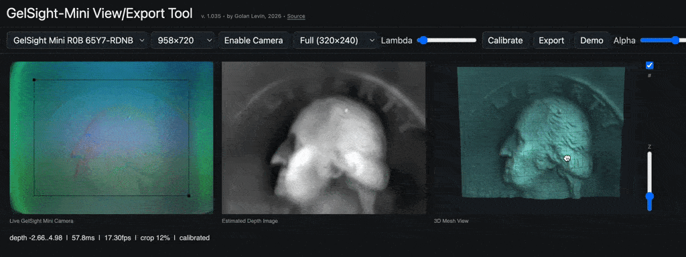
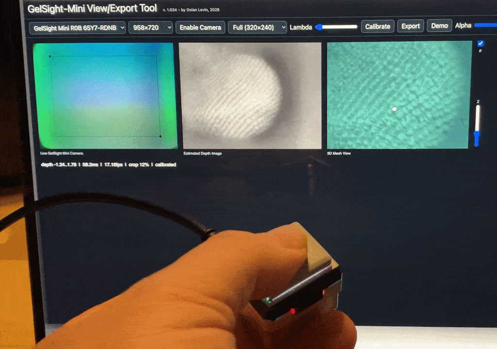
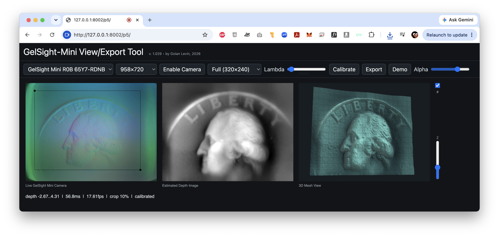

# GelSight-Mini View/Export Tool

## Material Studio and Texture Dictionary

The new [Material Studio guide](docs/studio.md) covers the local capture, atlas,
material/brush, print, gallery and specimen workflows. Start with
`./start-studio.ps1` after its one-time setup, then open http://127.0.0.1:8090.
The original viewer below is preserved. Important implementation and publication
decisions are tracked in [AGENTS.md](AGENTS.md); verification is recorded in
[studio-validation.md](docs/studio-validation.md). The public collection is empty
by owner request; example captures remain local drafts.

For the connected Mini and image typologies, double-click
**[Start-Material-Studio.cmd](Start-Material-Studio.cmd)**. It opens a dedicated
Chrome window with the Mini connected and **p5 Live Capture** ready.
Capture named RGB/depth/mesh bundles, then use **Live Typology** to compare them using the actual
[ShuffleSnap](https://github.com/kylemcdonald/shufflesnap) package.
See [the capture and typology guide](docs/mini-typology.md). Everything remains local.

### All Studio modes

| Mode | Function and workflow |
| --- | --- |
| 01 Surface Capture | Import RGB, height, normal maps, meshes, sequences or p5 ZIPs. Select background/calibration, reconstruct, and inspect height, masks and normals. |
| 02 Tactile Atlas | Register overlapping patches; review accepted/rejected links and separate islands. Similar appearance alone does not establish a verified join. |
| 03 Brush & Material Lab | Derive crops, filters and seamless artistic variants; make image brushes, draw strokes, preview flat/sphere materials and export maps. |
| 04 Print Studio | Bake relief into tiles, curved swatches, spheres or coupons. Supply dimensions or validated metric data, inspect geometric validation and export STL/3MF. Slicer/physical tests are separate. |
| 05 Material Gallery | Compare saved materials; export a backend-free gallery containing only selected assets. |
| 06 Texture Dictionary | Collect specimens, make reproducible gyotaku-inspired prints and pressure proofs, choose covers and public snapshots. Public specimens require explicit selection; the public collection remains empty. |
| 07 Live Typology | Quick RGB capture and ShuffleSnap comparison grids; coordinated raw/depth/mesh/clear-background sheets, actual assembled 3D relief, combined depth and normal maps in the same layout. |
| 08 p5 Live Capture | Embedded original p5 acquisition, controls, live depth and mesh. Calibrate without contact, name a sample and save all views together. |
| 09 Texture Unfolding | Separate program at `/unfold`: segment textures, propose neighboring regions, inspect a flat image, flat 3D mesh and wrapped ball. Joins are inferred artistic arrangements. |

### Live capture, depth and sensor calibration

The embedded viewer uses the bundled Golan Levin app itself; `/gelsight_p5/`
remains unchanged. **Camera resolution** offers 640×480, 958×720, 1640×1232 and
3280×2464. These are requested modes; actual negotiated dimensions are recorded.
**Fast** infers at 160×120 then upsamples slopes; **Full** infers at 320×240.
Both produce a **320×240 depth grid**. More camera pixels do not add model detail.

1. Open `Start-Material-Studio.cmd`. The dedicated Chrome profile selects a named
   GelSight only. Close another live feed before connecting here.
2. Set resolution and Fast/Full quality. The default crop removes **10% from each
   edge**, keeping the central 80% of both dimensions. Drag the original crop
   handles to override it, or use **Restore 10% edge crop**. The actual crop is
   recorded; full originals remain immutable.
3. Lift clear of contact, press **Calibrate**, and wait for **50 distinct frames**.
   This averages and subtracts the no-contact background. Recalibrate after
   changing crop, camera resolution, inference quality or Lambda. Studio rejects
   sample bundles while calibration is unfinished or stale.
4. Make steady contact. **Lambda** adjusts Poisson regularization; **Alpha** adjusts
   temporal input smoothing. **Z** exaggerates displayed mesh height and **#**
   switches interpolation. Drag to orbit/pan, scroll to zoom, double-click to reset.
5. Name the sample and **Save RGB + depth + current mesh view**. Cropped RGB,
   float solver depth, baseline if available, depth display, mesh screenshot and
   view settings are frozen from the same processing result. Smoothing can include
   previous frames. The screenshot retains your camera/Z settings; numerical
   height does not include display exaggeration.
6. In **Live Typology**, select these RGB captures and build once. Download the
   named contact sheet, plus **raw**, **depth** and **mesh** sheets, each with or
   without names. Every sheet uses identical cells. Here raw means cropped RGB;
   full originals stay local. Older missing views say “Not captured.” Long PNG
   names wrap/truncate; HTML and JSON retain full names.

**Actual 3D stitching and combined depth:** below a saved board, switch between
**Stitched 3D meshes** and **Combined depth map**. The first assembles real source
height geometry at the ShuffleSnap positions; it is more than a screenshot
collage. Orbit/zoom and enable wireframe. Download the actual OBJ, depth PNG or
floating-point depth/mask NPZ. For older boards, **Build 3D / depth / normal views from this
layout** creates a new revision without moving any cells. RGB-only captures need
a reconstructed patch first; missing depth remains empty. Existing p5 bundles
use their captured depth; older RGB frames use their latest linked reconstruction.
The manifest records precisely which source/version was used.

Each scan remains a separate component; adjacency in ShuffleSnap is visual
similarity, not physical overlap. No triangles bridge missing cells or independent
scan boundaries. OBJ coordinates use authored display scale, not millimeters.
Enable **Connect neighboring tiles with artistic seams** to bridge the facing
edges without moving the captured vertices. The combined depth view then shows
interpolated gaps. Connected OBJ/depth/NPZ exports are separate; the OBJ names its
synthetic face group and NPZ includes source/synthetic masks. These bridges are
invented connections for display, never evidence that two scans physically join.
NPY/NPZ preserve assembled height values (resampled to a bounded preview grid) and
mask. If metric and relative sources are mixed, heights are explicitly normalized
per source and labeled accordingly. Source arrays remain unchanged.

**Normal map mode:** click **Normal map** under the surface assembly. Choose
**OpenGL (+Y)** or **DirectX (−Y)**; DirectX reverses the green channel. The seam
checkbox switches this preview between separate scans and artistic connections.
Download either convention as a PNG, its validity mask, or floating-point OpenGL
unit normals and masks in NPZ. The private board ZIP includes all versions.
Normals derive from floating-point depth using the assembly's authored XY/Z
display scale, not from the grayscale PNG or a metric calibration. Separate-scan
derivatives never cross tile boundaries or holes. Connected maps derive from the
interpolated depth raster, so they are not exact OBJ triangle normals; their NPZ
also marks normals changed by the synthetic seams, including source-edge pixels.
Neutral blue `(128,128,255)` fills invalid pixels; use the normal mask to exclude
them. Import PNGs as **non-color/linear data** in a material editor and choose its
matching convention. Use them to shade a flat surface; adding the same normal
relief to fully displaced geometry can count that relief twice. Existing boards
gain these files through the new-revision button above; their originals stay intact.

**Clear-background and subtraction modes:** when you calibrate in p5 Live Capture,
Studio also averages the RGB model input over those same 50 no-contact frames.
New live samples save **clean.png** (original model-input color with transparent
background) and **difference.png** (absolute RGB difference, displayed at 3× gain).
The **Clear-background threshold** sets the RGB-difference norm needed to retain
a pixel; a small morphological opening suppresses noise. Lower values retain
faint changes; higher values remove more background. Preview these links after
saving, or download the **clean** and **difference** typology sheets with/without
names. These are visual contact masks, not object photographs or force measurements.
An old/demo sample without the matching RGB reference is marked unavailable;
no background is guessed. Recalibrate in the embedded live viewer to obtain one.
Numerical p5 depth already subtracts its depth background: it is never subtracted
twice. Bundles also retain `depth-before-background.npy = depth + baseline` when
a baseline exists, plus the baseline itself, for direct comparison.

The depth image is normalized grayscale, **not millimeters**. Saved sample
`depth.npy` contains floating-point solver values. The original p5 **Export**
still produces its ZIP with RGB, 16-bit display/solver depth, baseline, OBJ and
metadata; an optional high-resolution still is a later, non-synchronous grab.
**Demo** loads the bundled coin; saved demo bundles are labeled and excluded from
ordinary typologies by default.

**Metric calibration is separate.** Surface Capture accepts profiles with actual
sensor/gel IDs, exact input/crop dimensions, model, XY spacing in mm and independent
validation notes. The bundled Mini model and no-contact background alone cannot
establish metric accuracy. Match the calibration optical/crop setup to acquisition;
see [Studio calibration and formats](docs/studio.md) for adapters and training.

### Separate Texture Unfolding program

Open [Texture Unfolding locally](http://127.0.0.1:8090/unfold) while Studio runs.
It has its own page, selections, jobs and saved assemblies. Choose 1–32 RGB frames
or patches, one input per sample. Linked p5 RGB brings its depth automatically;
ordinary RGB stays flat. Choose 2–8 groups and a repeatable seed, then assemble.

The program clusters color, local contrast and directional gradients; extracts
connected regions; and proposes neighbors using texture groups and facing-edge
appearance/contour scores, trying 90-degree rotations. It retains larger regions
and reports excluded fragments and source coverage. **Separated regions** shows
cluster maps; **Flat image** shows the assembly; **Flat 3D mesh** preserves masked
holes and displays relative relief; **Wrapped ball** maps the whole image once,
with gaps, seam and pole distortion visible. Available depth is normalized per
source for display. Adjust relief strength or show wireframe.

This is an **inferred composition**, not recovered object topology or a geometric
unfolding of an observed closed mesh. Use Tactile Atlas for verified scan overlap.
Download the PNG or private ZIP with height/masks, region IDs, source previews,
hashes, crop references, region boxes, rotations, neighbors and scores. Assemblies
never become calibrated patches or enter the public dictionary automatically.
CLI: `python -m studio run --kind unfold --config unfolding.json`, with JSON fields
`items` (list of `{ "kind": "frames", "id": "…" }`), `name`, and
`settings` (`groups`, `columns`, `seed`).

> This is a browser-based tool for viewing, reconstructing, and exporting data
from a [GelSight Mini](https://www.gelsight.com/products/gelsightmini/) tactile sensor. This work was created by Golan Levin at CMU's Frank-Ratchye STUDIO for Creative Inquiry, August 2026.



#### Quick Links

* [**Purchase** a GelSight Mini](https://www.gelsight.com/product/gelsight-mini-system/) (~\$500-600)
* [**Test** the GelSight Mini browser tool, online](https://golanlevin.github.io/gelsight_p5/)
* [**View** a brief YouTube tutorial here](https://www.youtube.com/watch?v=4apYlLzpnoo)
* [**Read** the technical documentation here](technical_information_js.md)
* [**Watch** Steve Mould's video about GelSight](https://www.youtube.com/watch?v=qtQ4rK66vlE)

---

## Overview

> The GelSight family of tactile sensors are vision-based touch sensors that transform physical contact into high-resolution 3D measurements of surface geometry. Rather than relying on arrays of pressure sensors, a GelSight device contains a soft, transparent elastomer coated with a reflective membrane; when pressed against an object, the gel conforms to its microscopic topography, and an internal camera with colored LED illumination images the resulting deformation. Using photometric stereo, the system reconstructs a micron-scale 3D height map. Because the sensing process depends on geometry rather than optical appearance, GelSight can accurately inspect opaque, reflective, transparent, or textured materials with sub-micron depth sensitivity.

The [GelSight Mini](https://www.gelsight.com/products/gelsightmini/) is a [\$510 tactile sensor](https://www.gelsight.com/product/gelsight-mini-system/) which presents to the computer as a standard UVC webcam. The browser captures its live video stream, estimates a depth map from the colored tactile image, displays a 3D mesh preview, and exports captures as ZIP files containing images, depth maps, OBJ meshes, calibration data, and metadata.


---

## What You Need

- A GelSight Mini tactile sensor connected by USB.
- A recent desktop browser. Chrome is recommended.
- A local web server. The browser camera API works from `localhost`.

--- 

## First-Time Setup

If you wish, you can test the software online, at this URL: 

> [https://golanlevin.github.io/gelsight_p5/](https://golanlevin.github.io/gelsight_p5/)

***Alternatively***, you can run the software locally. Download or clone this repository, then start a local web server from the top-level project folder:

```sh
python3 -m http.server 8002
```

Then open this local web server URL in Chrome:

```text
http://127.0.0.1:8002/gelsight_p5/
```

Do not open `index.html` by double-clicking it. Browser camera access and local
WASM/model loading are more reliable from `http://localhost` than from a
`file://` URL.

---

## How To Use The Tool



1. Plug in the GelSight Mini.
2. Open the software tool in the browser, either served locally (`http://127.0.0.1:8002/gelsight_p5/`) as described above, or on this page: [https://golanlevin.github.io/gelsight_p5/](https://golanlevin.github.io/gelsight_p5/). *Note: all captures made on that page remain local to your machine.*
3. Choose the GelSight Mini from the Camera menu.
4. Choose a capture resolution. The default is intended to balance quality and
   speed.
5. Click `Enable Camera` and allow browser camera access if prompted.
6. Optionally, adjust the crop rectangle over the useful part of the GelSight image.
7. With nothing touching the gel surface, click `Calibrate`.
8. Wait for calibration to finish. Do not touch the sensor while it says
   `CALIBRATING`.
9. Press an object into the GelSight surface. The tool will show:
   - the live GelSight camera image
   - an estimated depth image
   - a 3D mesh preview
10. Use the controls as needed:
    - `Fast (160x120)` / `Full (320x240)` changes inference quality.
    - `Lambda` adjusts Poisson integration regularization.
    - `Alpha` adjusts temporal smoothing.
    - The vertical `Z` slider changes only the 3D preview scale.
11. If the `Calibrate` button pulses, recalibrate before trusting measurements. Changes such as crop or lambda can make the current calibration stale.
12. Click `Export` to save a ZIP file. This contains the exported files listed below. 

---

## Exported Files

Exports are named like:

```text
gelsight_YYYYMMDD_HHMMSS.zip
```

The ZIP can include:

- `capture.png`: the image used to compute the depth map and mesh.
- `capture_highres.jpg`: optional high-resolution camera grab.
- `depth_16bit.png`: normalized 16-bit depth image.
- `depth_solver_units_16bit.png`: fixed-range solver-unit depth image.
- `baseline_16bit.png`: calibration baseline, when available.
- `mesh.obj`: exported 3D mesh.
- `metadata.json`: capture, calibration, processing, and export metadata.

---

## Demo Mode



The `Demo` button loads a sample export from `gelsight_p5/captures/`, a scan of a US coin. This is
useful for trying the interface without a connected sensor. When Demo mode is
active, the button changes to `Live`; click it to return to the camera.

## Notes

- The depth values are solver units, not calibrated millimeters.
- For best results, recalibrate after changing crop, lambda, inference quality,
  capture resolution, or sensor lighting/contact conditions.
- The 3D preview scale does not affect the exported OBJ.
- Technical implementation notes are in `technical_information_js.md`.
- A possible TouchDesigner roadmap is in `technical_information_td.md`.

## License

This project is intended to be distributed under GPL-3.0-or-later. See the [technical documentation](technical_information_js.md) for notes about redistributed GelSight-derived
model assets and third-party browser/runtime components.
